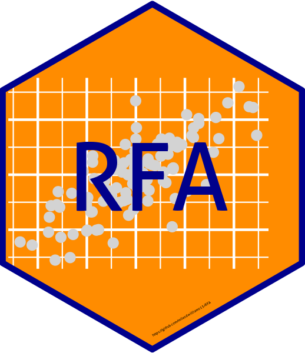

# RFA 

`RFA` is an R package for implementing random forest adjustment (RFA). RFA is a regression adjustment approach that partials out variation in a response and explanatory variable of interest given a set of covariates using random forests. The latest version of the package relies on `ranger`, which is a fast implementation of random forests.

# Installation
To install and attach the latest version of `RFA`, enter:

    devtools::install_github("milesdwilliams15/RFA")
    library(RFA)

# Usage
`RFA` relies on `ranger` to implement random forests, and `estimatr` to perform linear regression on the random forest adjusted explanatory variable and response. 

For a generic dataset, `dataset`, that contains vectors of some response variable `y`, an explanatory variable of interest `z`, and a set of confounding covariates `x1`, `x2`, and `x3`, random forest adjusted estimates are obtained by entering:

    rfa(
      y ~ z,
      covariates = ~ x1 + x2 + x3,
      data = dataset
    )

The function returns a list consisting of an `estimatr::lm_robust` object, the computed random forest regressions for the response and explanatory variable (`ranger::ranger` objects), and the dataset used to generate random forest adjusted estimates with the partialized versions of the response and explanatory variable appended.

For a more comprehensive summary of the approach and how to implement it in R, see the [RFA vignette](https://rpubs.com/milesdwilliams15/rfa-vignette).
