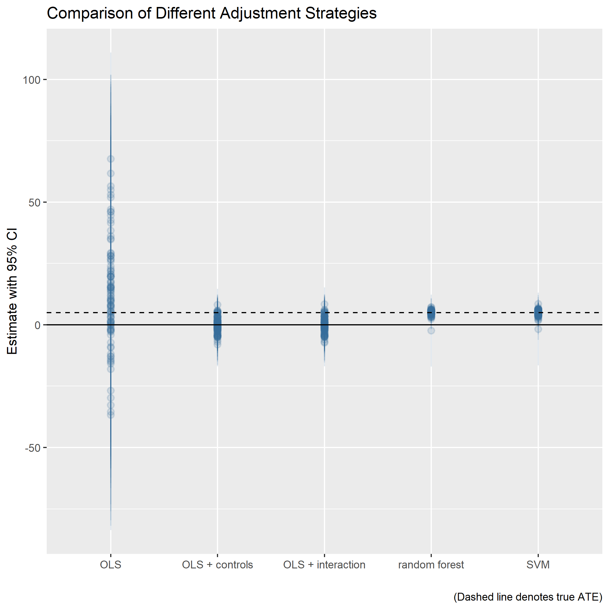

```{r setup, include = FALSE}
knitr::opts_chunk$set(
  collapse = TRUE,
  comment = "#>"
)
```

Random Forest Adjustment (RFA) is a procedure for estimating the average treatment effect (ATE) of some predictor on a response using observational data. As the name implies, the routine uses random forest (RF) regression to adjust for the confounding variation in a response and the causal variable of interest prior to estimating the ATE. Below I provide a brief explanation of the technique and demonstrate how it is implemented in R.

## RFA in a Nutshell

RFA provides an alternative adjustment strategy for generating an ATE from observational data. By leveraging a nonparametric machine learning algorithm such as RF, RFA sidesteps the incidental functional form assumptions imposed by regression based adjustment or by matching via a propensity score generated from a logit model. 

RFA begins by predicting some response $y_i$ and some causal variable of interest $z_i$ as a function of covariates $x_{ip} \in X_i$ where $y_i,z_i \not\!\perp\!\!\!\perp X_i$. The variables $y_i$ and $z_i$ denote vectors of response and treatment values for the $i^\text{th}$ observation where $i \in I = \{1,2,...,n \}$. 

Because $z_i$ and $y_i$ are not independent of $X_i$, the estimated slope coefficient ($\alpha_1$) from the following naive OLS model will not reflect the true ATE of $z_i$ on $y_i$:
$$y_i = \alpha_0 + \alpha_1z_i + \epsilon_i. \tag{1}$$
RFA's solution to this problem is to partial out the variation in $y_i$ and $z_i$ explained by $X_i$ prior to estimating the ATE:

  1. The first step is to fit $y_i$ as a function of $X_i$ via a RF model:

$$
\begin{aligned}
\hat{y}_i & = \hat{f}(X_i), \\
\hat{y}_i^\varepsilon & = y_i - \hat{y}_i.
\end{aligned} \tag{2}
$$

  2. This step is then repeated for $z_i$:

$$
\begin{aligned}
\hat{z}_i & = \hat{g}(X_i), \\
\hat{z}_i^\varepsilon & = z_i - \hat{z}_i.
\end{aligned} \tag{3}
$$

  3. Finally, the ATE, adjusting for the confounding influence of $X_i$, is obtained by estimating the following OLS model:

$$\hat{y}_i^\varepsilon = \beta_0 + \beta_1\hat{z}_i^\varepsilon + \mu_i.\tag{4}$$

The estimate for $\beta_1$ in the above denotes the ATE. To avoid distributional assumptions about $\mu_i$ in making statistical inferences, the empirical distribution of ATE estimates is approximated via residual (or model-based) resampling.

## What is the Benefit of This Approach?

The advantage of RFA is that it sidesteps incidental functional form assumptions that common adjustment strategies impose. This can be seen by considering the following fact about least squares regression, the workhorse adjustment strategy.

With the covariates given in the preceding section, define the matrix $\mathbf{W}$ as
$$
\mathbf{W} = 
\begin{bmatrix}
1 & z_1 & x_1^1 & \cdots & x_1^k \\
\vdots & \vdots & \vdots & \ddots & \vdots \\
1 & z_n & x_n^1 & \cdots & x_n^k
\end{bmatrix}_{n,k+2}
$$
and define the matrix $\mathbf{y}$ as
$$
\mathbf{y} = 
\begin{bmatrix}
y_1 \\
\vdots \\
y_n
\end{bmatrix}_{n,1}.
$$
Using ordinary least squares (OLS), we estimate the linear model
$$\mathbf{y} = \mathbf{X}\boldsymbol{\beta} + \boldsymbol{\epsilon},$$
where the solution for the parameters to be estimated is
$$
\hat{\boldsymbol{\beta}} = 
\begin{bmatrix}
\hat{\beta}_0 \\
\hat{\beta}_1 \\
\hat{\beta}_2^1 \\
\vdots \\
\hat{\beta}_{k+2}^k
\end{bmatrix} = (\mathbf{W}^\top\mathbf{W})^{-1} (\mathbf{W}^\top \mathbf{y}).
$$
The parameter $\hat{\beta}_1 \in \hat{\boldsymbol{\beta}}$ is the estimated effect of $z_i$ (the causal variable of interest in our running example).

This approach is potentially problematic for the following reason. Consider an equivalent way of generating $\hat{\beta}_1$ via OLS. 

  1. Estimate an OLS model excluding $z_i$ from the matrix $\mathbf{W}$ and with $\mathbf{y}$ as the left-hand side variable. Denote the new $n \times k + 1$ matrix that excludes the causal variable interest as $\mathbf{X}$. After estimating this model using the same procedure outlined above, generate predicted values of the outcome variable and estimate the model residuals (note the similarity to step 1 of RFA).
  
$$
\begin{aligned}
\hat{\mathbf{y}} & = \mathbf{X}\hat{\boldsymbol{\gamma}}, \\
\hat{\mathbf{y}}^\epsilon & = \mathbf{y} -  \hat{\mathbf{y}}.
\end{aligned}
$$

  2. Repeat the above, but have the $n \times 1$ matrix $z$ (a matrix of values for the causal variable) be the left-hand side variable (again, note the similarity to step 2 of RFA).
  
$$
\begin{aligned}
\hat{\mathbf{z}} & = \mathbf{X}\hat{\boldsymbol{\delta}}, \\
\hat{\mathbf{z}}^\epsilon & = \mathbf{z} -  \hat{\mathbf{z}}.
\end{aligned}
$$

  3. Finally, estimate $\beta_1$ via an OLS model specified as

$$\hat{y}_i^\epsilon = \mu + \beta_1z_i + \varepsilon_i.$$

The $\hat{\beta}_1$ generated from step 3 will be equivalent to the one estimated above.

At this point, it should start to become clear why OLS is potentially problematic. OLS, while imposing the assumption that $y_i$ and $z_i$ are linearly related, also imposes the assumption that the confounding variables are linearly and additively associated with $y_i$ and $z_i$. And this equivalent way of expressing OLS given above is only the first layer of an onion of linear additive models within linear additive models which could be used to estimate equivalent parameters for all of the variables contained in $\mathbf{W}$. This is not to mention the googleplex of potential "sub"-parameters implied by assuming linearity and additivity *all the way down*. If in any of the linear additive models upon linear additive models is misspecified, this portends bias in $\hat{\beta}_1$.

This is where the power of RFA lies. RFA imposes no functional form on the relationship between the confounders and the response and causal variable, and it also imposes no functional form assumptions about how any and all of the confounders relate to each other. It sidesteps the Russian doll altogether as it isolates the residual variation in the response and causal variable.

## A Simulation

To hammer home the point that RFA is advantageous, consider the following results from a simulation I ran. Here are some of the details of said simulation:

  1. I set $n = 500$ and set the ATE ($\beta_1$) to 5.
  2. The "true" d.g.p. for the outcome variable $y_i$ is given as
  
$$y_i = 1 + 5z_i + 0.5x_i + x_i^2 + e_i:e_i \sim \mathcal{N}(0, \sigma = 10).$$

  3. The causal variable $z_i$ is given as
  
$$z_i = -1 + 0.05\space \text{stand}(x_i) - 0.1 \space \text{stand}(x_i)^2 + u_i: u_i \sim \mathcal{N}(0, \sigma = 2).$$

  4. The confounding variable $x_i \sim \mathcal{N}(50, \sigma = 10)$.

I try a number of methods to recover estimates of the ATE of $z_i$:

  1. A naive OLS model:
  
$$y_i = \beta_0 + \beta_1z_i + \epsilon_i.$$

  2. An OLS model with controls:
  
$$y_i = \beta_0 + \beta_1z_i + \beta_2x_i + \epsilon_i.$$

  3. An interaction model with $x_i$ mean centered:

$$y_i = \beta_0 + \beta_1z_i + \beta_2x_i + \beta_3z_i\cdot(x_i - \bar{x}) + \epsilon_i.$$

  4. Adjust via a Support Vector Machine (SVM)---I use the same steps as with RFA, save that I control for the confounding effect of $x_i$ with SVM.
  
  5. Finally, I use RFA.
  
Because both SVM and RF take a while to run, for time's sake I restricted my simulation to 100 iterations. 

A summary of the performance of each of these approaches is given in the below table. Metrics I use to gauge performance include mean squared error (MSE) of the ATE estimate, average difference between the estimated ATE and the true ATE, and 100 minus the false negative rate (type II error) for the 95% CIs of the estimated ATEs. 

<table>
 <thead>
  <tr>
   <th style="text-align:left;"> model </th>
   <th style="text-align:right;"> MSE of coefficient </th>
   <th style="text-align:right;"> Mean Difference from ATE </th>
   <th style="text-align:right;"> Pr that 95% CI Contains ATE </th>
  </tr>
 </thead>
<tbody>
  <tr>
   <td style="text-align:left;"> OLS </td>
   <td style="text-align:right;"> 49651.34 </td>
   <td style="text-align:right;"> 7.38 </td>
   <td style="text-align:right;"> 0.93 </td>
  </tr>
  <tr>
   <td style="text-align:left;"> OLS + controls </td>
   <td style="text-align:right;"> 3678.41 </td>
   <td style="text-align:right;"> -5.14 </td>
   <td style="text-align:right;"> 0.66 </td>
  </tr>
  <tr>
   <td style="text-align:left;"> OLS + interaction </td>
   <td style="text-align:right;"> 3573.97 </td>
   <td style="text-align:right;"> -5.05 </td>
   <td style="text-align:right;"> 0.64 </td>
  </tr>
  <tr>
   <td style="text-align:left;"> random forest </td>
   <td style="text-align:right;"> 121.44 </td>
   <td style="text-align:right;"> -0.16 </td>
   <td style="text-align:right;"> 0.95 </td>
  </tr>
  <tr>
   <td style="text-align:left;"> SVM </td>
   <td style="text-align:right;"> 154.53 </td>
   <td style="text-align:right;"> -0.19 </td>
   <td style="text-align:right;"> 1.00 </td>
  </tr>
</tbody>
</table>

RFA clearly performs the best out of all of the adjustment strategies. This is also clear from the following figure showing the distribution of estimated ATE replicates after 100 runs of the simulation. The estimates provided by RFA are most closely centered around the true ATE, and the RFA estimates themselves are the most efficient (with RFA's use of model-based inference, I reject the null 95% of the time, as I should with use of 95% CIs).

```{r, echo=FALSE, out.width="400px"}

```


## How to Implement in R

The `rfa` function in the `RFA` package allows the researcher to easily implement the RFA routine. Here, I demonstrate how the program is used with the assistance of the `GerberGreenImai` dataset included in the `Matching` package. This dataset was used in Imai (2005) to replicate and extend Gerber and Green's (2000) get-out-the-vote (GOT) field experiment. The dataset was used to assess the causal effect of telephone calls on turnout.

Let's get the data into the working environment:

```{r}
library(tidyverse) # grammar
library(Matching)
data(GerberGreenImai)
ggi = GerberGreenImai # give it a shorter name
```

The first thing to do is install the `RFA` package (if not already), and then open it:

```{r}
# devtools::install_github("milesdwilliams15/RFA")
library(RFA)
```

Next, we implement the RFA routine with the function `rfa`. In the formula object below, the left-hand side variable is a binary response that equals 1 when an individual citizen turned out to vote in the 1998 congressional election in New Haven, CT. The treatment variable (whether the individual received a GOT phone call) is the first right-hand side variable in the formula. The remaining variables are confounders: an individual's age, whether they voted in the previous election (in 1996), the number of persons residing in their household, whether they are a new voter, whether they support the majority party, and their ward of residence in New Haven.

```{r}
result = rfa(
  VOTED98 ~ PHN.C1 + # treatment variable
    AGE + VOTE96.1 + PERSONS + NEW + MAJORPTY + WARD, # confounders
  ggi
)
```

`rfa` takes a formula object---**where the first right-hand side variable is assumed to be the treatment and the remaining covariates confounders**---and the data frame containing the variables used for analysis as inputs. It then returns a list containing the estimated ATE:

```{r}
result$ate # the ATE
```

a vector of bootstrapped ATE values obtained via model-based resampling (999 replicates are used):

```{r}
head(result$bootate)
```

and a data frame containing the predictor and response values pre- and post- adjustment:

```{r}
head(result$data)
```

From the above, we see that the RFA routine estimates that the ATE of a GOT phone call on the probability of turning out to vote is approximately `r round(result$ate,3)`. Is this ATE statistically significant? To find out, I can use the `summary_rfa` function to return the summary statistics for the calculated ATE:

```{r}
summary_rfa(result)
```

Sure enough, the ATE is statistically significant, with $p < 0.01$.

We can also use the `plot_rfa` function to plot the distribution of bootstrapped ATE replicates:

```{r}
plot_rfa(result)
```

Further, since `plot_rfa` is a wrapper for `ggplot2`, we can modify the RFA plot however we see fit:

```{r}
plot_rfa(result) +
  labs(
    x = "A New X-Label",
    y = "A New Y-Label",
    title = "I Like ggplot"
  ) +
  theme_test()
```

The data returned by `rfa` further provides a vector called `Yt` and one called `Yc`. These are potential outcomes under treatment and under control. We can use these to simulate the average treatment effect for the treated (ATT) and the average treatment effect for the controls (ATC).

Here's the ATT with quantile bootstrap 95% CIs:

```{r}
ATT = result$data %>%
  mutate(preZ==1) %>%
  summarize(ATT = mean(Yt) - mean(Yc)) %>%
  .$ATT
ATTboot = 0
for(i in 1:999){
  ATTboot[i] = result$data %>%
    filter(preZ==1) %>%
    summarize(ATT = mean(sample(Yt,size=n(),replace=T) - 
                sample(Yc,size=n(),replace=T))) %>%
    .$ATT
}
ATTsummary = cbind(ATT = ATT, 
                   rbind(c(quantile(ATTboot,c(.025,.975)))))
rownames(ATTsummary) = c('change in Pr(turnout)')
ATTsummary
```

And here's the ATC with the same:

```{r}
ATC = result$data %>%
  mutate(preZ==0) %>%
  summarize(ATC = mean(Yt) - mean(Yc)) %>%
  .$ATC
ATCboot = 0
for(i in 1:999){
  ATCboot[i] = result$data %>%
    filter(preZ==0) %>%
    summarize(ATC = mean(sample(Yt,size=n(),replace=T) - 
                sample(Yc,size=n(),replace=T))) %>%
    .$ATC
}
ATCsummary = cbind(ATC = ATC, 
                   rbind(c(quantile(ATCboot,c(.025,.975)))))
rownames(ATCsummary) = c('change in Pr(turnout)')
ATCsummary
```

